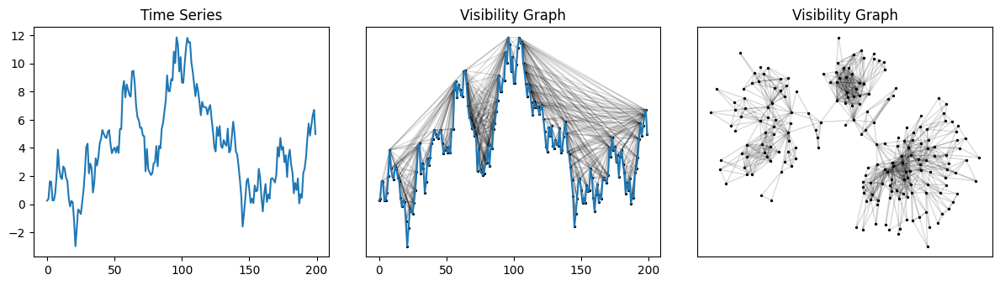
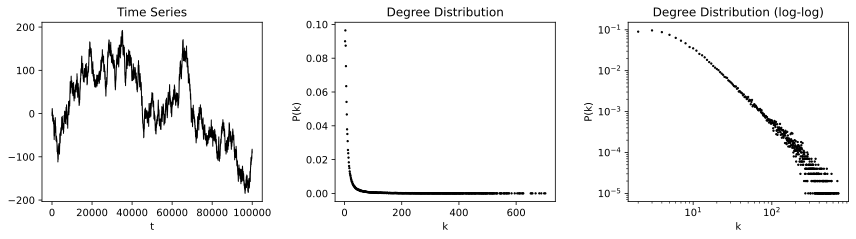
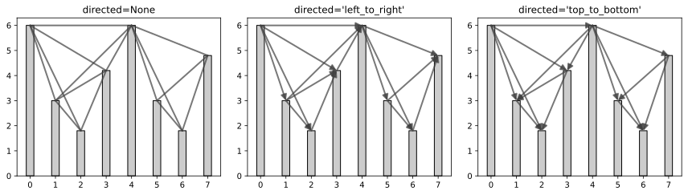
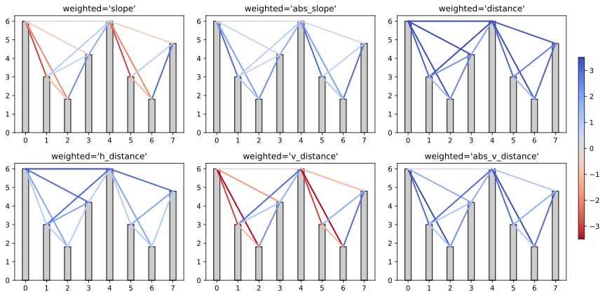
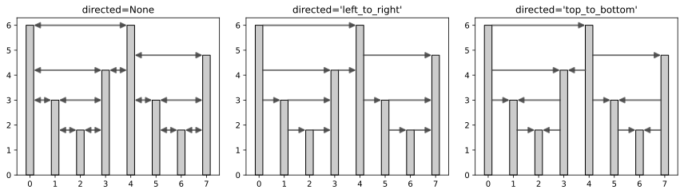

Examples
========

Computing and drawing visibility graphs
---------------------------------------

This example builds the visibility graph for a generated Brownian motion time series
and draws the graph with the help of `NetworkX <https://networkx.github.io/>`_.

.. code:: python

    from ts2vg import NaturalVG
    import networkx as nx
    import numpy as np
    import matplotlib.pyplot as plt

    # 1. Generate Brownian motion series
    rng = np.random.default_rng(110)
    ts = rng.standard_normal(size=200)
    ts = np.cumsum(ts)

    # 2. Build visibility graph
    g = NaturalVG(directed=None).build(ts)
    nxg = g.as_networkx()

    # 3. Make plots
    fig, [ax0, ax1, ax2] = plt.subplots(ncols=3, figsize=(12, 3.5))

    ax0.plot(ts)
    ax0.set_title('Time Series')

    graph_plot_options = {
        'with_labels': False,
        'node_size': 2,
        'node_color': [(0, 0, 0, 1)],
        'edge_color': [(0, 0, 0, 0.15)],
    }

    nx.draw_networkx(nxg, ax=ax1, pos=g.node_positions(), **graph_plot_options)
    ax1.tick_params(bottom=True, labelbottom=True)
    ax1.plot(ts)
    ax1.set_title('Visibility Graph')

    nx.draw_networkx(nxg, ax=ax2, pos=nx.kamada_kawai_layout(nxg), **graph_plot_options)
    ax2.set_title('Visibility Graph')

Getting the adjacency matrix
----------------------------

This example shows how to obtain the adjacency matrix for the visibility graph of a time series.

See :meth:`adjacency_matrix() <ts2vg.NaturalVG.adjacency_matrix>` for more options.

.. code:: python

    from ts2vg import NaturalVG

    ts = [6., 3., 1.8, 4.2, 6., 3., 1.8, 4.8]

    g = NaturalVG().build(ts)

    g.adjacency_matrix(triangle='lower')

::

    array([[0, 0, 0, 0, 0, 0, 0, 0],
       [1, 0, 0, 0, 0, 0, 0, 0],
       [1, 1, 0, 0, 0, 0, 0, 0],
       [1, 1, 1, 0, 0, 0, 0, 0],
       [1, 1, 0, 1, 0, 0, 0, 0],
       [0, 0, 0, 0, 1, 0, 0, 0],
       [0, 0, 0, 0, 1, 1, 0, 0],
       [0, 0, 0, 0, 1, 1, 1, 0]], dtype=uint8)

Getting the degree distribution
-------------------------------

This example shows how to get the degree distribution for the visibility graph of a given time series.

To illustrate it, we generate a Brownian motion time series with 100.000 data points
and then compute and plot its degree distribution.

.. code:: python

    from ts2vg import NaturalVG
    import numpy as np
    import matplotlib.pyplot as plt

    # 1. Generate Brownian motion series
    rng = np.random.default_rng(0)
    ts = rng.standard_normal(size=100_000)
    ts = np.cumsum(ts)

    # 2. Build visibility graph
    g = NaturalVG().build(ts, only_degrees=True)

    # 3. Get degree distribution
    ks, ps = g.degree_distribution

    # 4. Make plots
    fig, [ax0, ax1, ax2] = plt.subplots(ncols=3, figsize=(12, 3.5))

    ax0.plot(ts, c='#000', linewidth=1)
    ax0.set_title('Time Series')
    ax0.set_xlabel('t')

    ax1.scatter(ks, ps, s=2, c='#000', alpha=1)
    ax1.set_title('Degree Distribution')
    ax1.set_xlabel('k')
    ax1.set_ylabel('P(k)')

    ax2.scatter(ks, ps, s=2, c='#000', alpha=1)
    ax2.set_yscale('log')
    ax2.set_xscale('log')
    ax2.set_title('Degree Distribution (log-log)')
    ax2.set_xlabel('k')
    ax2.set_ylabel('P(k)')

Directed graphs
---------------

This example illustrates different options for the ``directed`` parameter when building visibility graphs.

.. code:: python

    from ts2vg import NaturalVG
    import matplotlib.pyplot as plt

    ts = [6., 3., 1.8, 4.2, 6., 3., 1.8, 4.8]

    direction_options = [
        None,
        'left_to_right',
        'top_to_bottom',
    ]

    fig, axs = plt.subplots(ncols=3, figsize=(12, 3.5))

    for d, ax in zip(direction_options, axs.flat):
        g = NaturalVG(directed=d).build(ts)
        plot_graph_demo(g, ax=ax, title=f"directed={repr(d)}")

.. admonition:: Code for :meth:`plot_graph_demo`
   :class: toggle

    .. literalinclude:: misc/plot_graph_demo.py
        :language: python

Weighted graphs
---------------

This example illustrates different options for the ``weighted`` parameter when building visibility graphs.

.. code:: python

    from ts2vg import NaturalVG
    import matplotlib.pyplot as plt

    ts = [6., 3., 1.8, 4.2, 6., 3., 1.8, 4.8]
    weight_options = [
        'slope',
        'abs_slope',
        'distance',
        'h_distance',
        'v_distance',
        'abs_v_distance',
    ]

    fig, axs = plt.subplots(ncols=3, nrows=2, figsize=(12, 6))
    cbar_ax = fig.add_axes([0.96, 0.2, 0.01, 0.6])

    for w, ax in zip(weight_options, axs.flat):
        g = NaturalVG(weighted=w).build(ts)
        plot_graph_demo(g, ax=ax, title=f"weighted='{w}'", cbar_ax=cbar_ax)

.. admonition:: Code for :meth:`plot_graph_demo`
   :class: toggle

    .. literalinclude:: misc/plot_graph_demo.py
        :language: python

Horizontal visibility graphs
----------------------------

This example illustrates different options for horizontal visiblity graphs.

.. code:: python

    from ts2vg import HorizontalVG
    import matplotlib.pyplot as plt

    ts = [6., 3., 1.8, 4.2, 6., 3., 1.8, 4.8]

    direction_options = [
        None,
        'left_to_right',
        'top_to_bottom',
    ]

    fig, axs = plt.subplots(ncols=3, figsize=(12, 3.5))

    for d, ax in zip(direction_options, axs.flat):
        g = HorizontalVG(directed=d).build(ts)
        plot_graph_demo(g, ax=ax, title=f"directed={repr(d)}", arrow_heads=True)

.. admonition:: Code for :meth:`plot_graph_demo`
   :class: toggle

    .. literalinclude:: misc/plot_graph_demo.py
        :language: python
