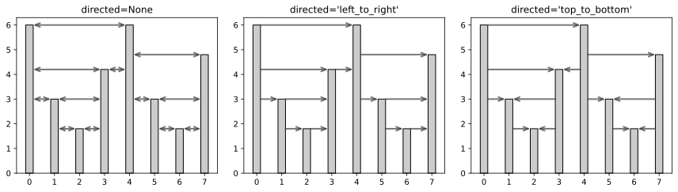
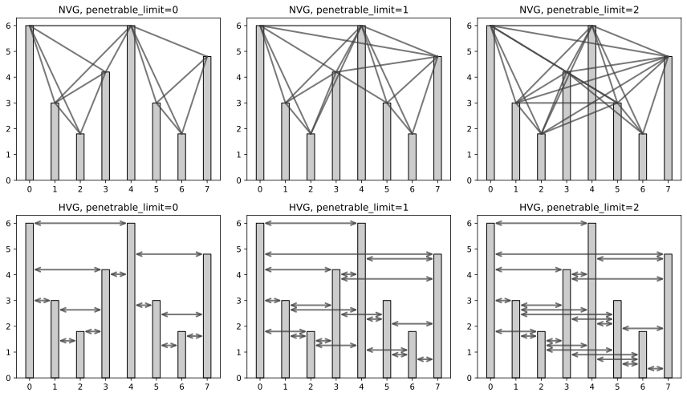

Examples
========

Computing and drawing visibility graphs
---------------------------------------

This example builds the visibility graph for a randomly generated motion time series
and draws the graph with the help of `NetworkX <https://networkx.github.io/>`_.

.. literalinclude:: examples/basic.py
    :language: python

.. figure:: examples/basic.png
   :width: 100%
   :alt: Example plots of a visibility graph

Obtaining the adjacency matrix
------------------------------

This example shows how to obtain the adjacency matrix for the visibility graph of a time series.

See :meth:`adjacency_matrix() <ts2vg.NaturalVG.adjacency_matrix>` for more options.

.. literalinclude:: examples/adjacency_matrix.py
    :language: python

::

    array([[0, 0, 0, 0, 0, 0, 0, 0],
       [1, 0, 0, 0, 0, 0, 0, 0],
       [1, 1, 0, 0, 0, 0, 0, 0],
       [1, 1, 1, 0, 0, 0, 0, 0],
       [1, 1, 0, 1, 0, 0, 0, 0],
       [0, 0, 0, 0, 1, 0, 0, 0],
       [0, 0, 0, 0, 1, 1, 0, 0],
       [0, 0, 0, 0, 1, 1, 1, 0]], dtype=uint8)

Obtaining the degree distribution
---------------------------------

This example shows how to get the degree distribution for the visibility graph of a given time series.

Here, we generate a random time series with 100.000 data points and then compute and plot its degree distribution.

.. literalinclude:: examples/degree_distribution.py
    :language: python

.. figure:: examples/degree_distribution.svg
    :width: 100%
    :alt: Example degree distribution

Building directed graphs
------------------------

This example illustrates different options for the ``directed`` parameter when building visibility graphs.

.. literalinclude:: examples/directed.py
    :language: python
    :start-after: # ~~

.. admonition:: Code for :meth:`plot_nvg`
   :class: dropdown

    .. literalinclude:: examples/plot_utils.py
        :language: python
        :start-after: # ~~ plot_nvg
        :end-before: # $$

Building weighted graphs
------------------------

This example illustrates different options for the ``weighted`` parameter when building visibility graphs.
See :ref:`Weighted graphs` for a complete list of available values for ``weighted``.

.. literalinclude:: examples/weighted.py
    :language: python
    :start-after: # ~~

.. figure:: examples/weighted.svg
   :width: 100%
   :alt: Example weighted graphs

.. admonition:: Code for :meth:`plot_weighted_nvg`
   :class: dropdown

    .. literalinclude:: examples/plot_utils.py
        :language: python
        :start-after: # ~~ plot_weighted_nvg
        :end-before: # $$

Building horizontal visibility graphs
-------------------------------------

This example illustrates different options for horizontal visibility graphs.
Note that horizontal visibility graphs can also be directed and/or weighted.

.. literalinclude:: examples/horizontal.py
    :language: python
    :start-after: # ~~

.. admonition:: Code for :meth:`plot_utils`
   :class: dropdown

    .. literalinclude:: examples/plot_utils.py
        :language: python
        :start-after: # ~~ plot_hvg
        :end-before: # $$

Building limited penetrable visibility graphs
---------------------------------------------

Limited penetrable visibility graphs (LPVG) are a variation of visibility graphs
in which nodes are allowed to have a certain number of obstructions between them
and still have a connecting edge in the resulting graph.
Limited penetrable visibility graphs might be more robust to noise in the data.

The maximum number of data points that are allowed to obstruct two nodes is given by the
``penetrable_limit`` parameter.
Note that when ``penetrable_limit`` is 0, the behavior is exactly the same as a regular (non-penetrable) visibility graph.

.. literalinclude:: examples/penetrable.py
    :language: python
    :start-after: # ~~

.. admonition:: Code for :meth:`plot_nvg`, :meth:`plot_hvg`
   :class: dropdown

    .. literalinclude:: examples/plot_utils.py
        :language: python
        :start-after: # ~~ plot_nvg
        :end-before: # $$

    .. literalinclude:: examples/plot_utils.py
        :language: python
        :start-after: # ~~ plot_hvg
        :end-before: # $$

Partitioning time series via community detection
------------------------------------------------

Time series can be partitioned by applying community detection algorithms to their visibility graphs.

.. literalinclude:: examples/partitioning.py
    :language: python

.. figure:: examples/partitioning.png
   :width: 100%
   :alt: Example partitioning of visibility graphs
